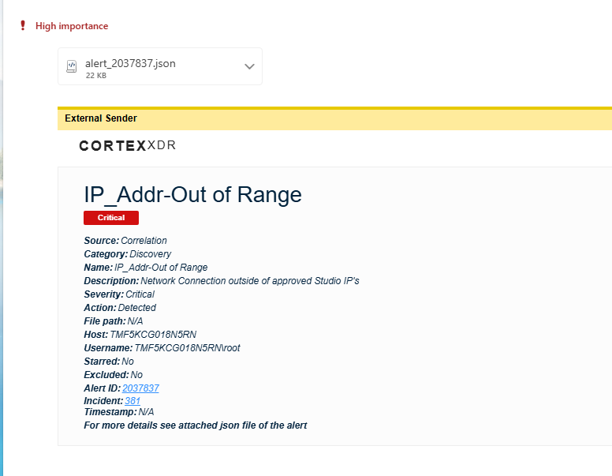

### Cortex XDR: IP_Addr-Out of Range Alert

This runbook addresses Cortex alerts for endpoints that are connected to a network outside the approved T-Studios network scope.

The most common cause is an endpoint connected to Wi-Fi while also connected to the approved wired network.

---

## Alert Intake

1. An email alert will be sent to the team.

Example:



2. Open the attached alert `.json` file.

3. Identify the endpoint hostname.

Look for:

```json
"agent_hostname":"TMF5KCG018N5RN"
```

4. Identify the offending IP address.

Look for:

```json
"ipaddr":"10.35.240.238"
```

> [!NOTE]
> The `ipaddr` field is the IP that triggered the correlation rule. The endpoint may have multiple IPs listed under `agent_ip_addresses`, but `ipaddr` is the one that failed the approved CIDR check.

---

## Cortex Investigation

5. Find the endpoint in Cortex.

Search for the value from:

```json
"agent_hostname"
```

6. Start a malware scan.

Path:

```text
Right-click endpoint > Security Options > Initiate Malware Scan
```

7. Start a Live Terminal session to the same endpoint.

Path:

```text
Hover over Endpoint line > second icon on far right > Live Terminal
```

> [!NOTE]
> A minimum of 20 characters is required to start the Live Terminal session.

---

## Endpoint Validation

8. Find which interface has the offending IP.

```bash
ifconfig -a | grep -B3 -A6 "<offending-ip>"
```

Example:

```bash
ifconfig -a | grep -B3 -A6 "10.35.240.238"
```

Example output:

```text
options=6460<TSO4,TSO6,CHANNEL_IO,PARTIAL_CSUM,ZEROINVERT_CSUM>
ether 36:ea:4d:93:51:ad
inet6 fe80::148a:1111:318f:a71d%en2 prefixlen 64 secured scopeid 0x8
inet 10.35.240.238 netmask 0xfffff800 broadcast 10.35.247.255
nd6 options=201<PERFORMNUD,DAD>
media: autoselect
status: active
```

In this example, the offending IP is assigned to `en2`.

Validate with 

```bash
ifconfig en2
```

9. Map the interface to hardware.

```bash
networksetup -listallhardwareports
```

Match the interface from the previous step to the hardware port.

Example:

```text
Hardware Port: Wi-Fi
Device: en2
Ethernet Address: f8:ff:c2:5f:7c:9f
```

10. Check the default route.

```bash
route -n get default
```

Example of a bad state:

```text
gateway: 10.35.240.1
interface: en2
```

> [!WARNING]
> If the default route points to the offending interface, the endpoint is actively using the out-of-range network as its primary network path.

---

## Resolution

The most common resolution is to have the user disconnect from Wi-Fi.

1. Ask the user to disconnect from Wi-Fi.


---

## Validation

1. Confirm the offending IP is no longer present.

```bash
ifconfig -a | grep -B3 -A6 "<offending-ip>"
```

Expected result:

```text
No output
```

2. Confirm the default route is no longer using the offending interface.

```bash
route -n get default
```

Expected result:

```text
gateway: <approved wired gateway>
interface: <approved wired interface>
```

Example of a good state:

```text
gateway: 10.79.164.1
interface: en0
```

3. Confirm the approved interfaces are still active.

```bash
ifconfig en0
ifconfig en1
```

Example expected state:

```text
en0 = approved wired corporate network
en1 = approved NAS / storage network
```

---
