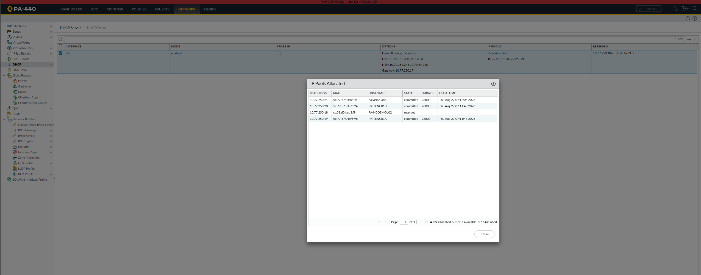
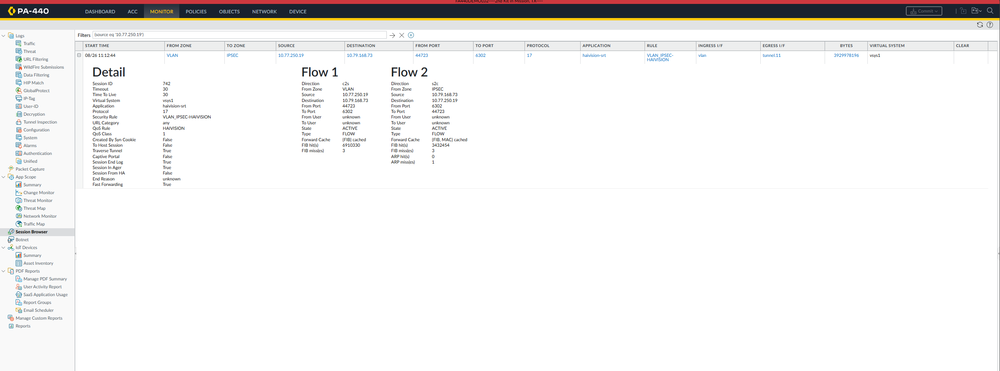
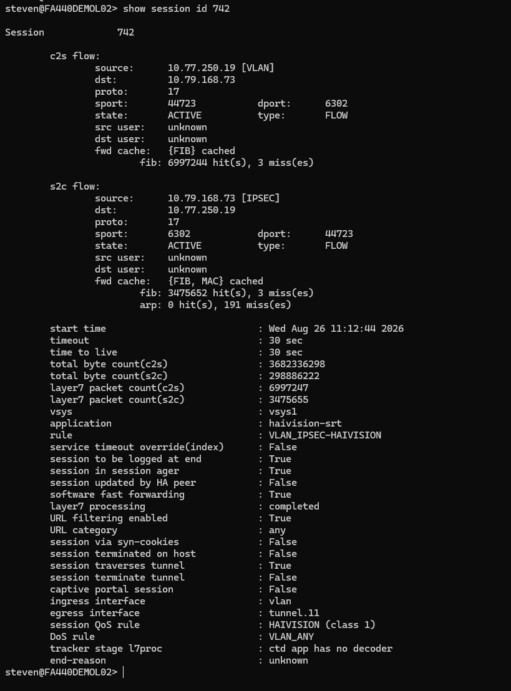

# note at the time writing this, the focus is more on the 440 to validate encoder is passing traffic. 

# pre-reqs: ipsec tunnels are are connected. working admin session to the firewall device

1. Network > DHCP > DHCP Allocation
   - Identify encoder IP
   - Confirm lease is active
   - Note encoder hostname if available

   Example:
   ****

2. Monitor > Session Browser
   - Filter:
     (source eq '<encoder-ip>')
   - Locate haivision-srt session
   - Expand session details

   Example:
   

3. Verify in Session Browser
   - State = ACTIVE
   - Application = haivision-srt
   - Source = Encoder IP
   - Destination = Remote decoder IP
   - Traverse Tunnel = True
   - Security Rule = VLAN_IPSEC-HAIVISION
   - Session ID = <number>

4. (Optional) CLI deep-dive
   show session id <number>

   Example:
   

5. Verify
   - Start Time
   - Total Bytes
   - Packet Counts
   - Egress Interface = tunnel.x
   - Session traverses tunnel = True

6. Re-check later
   - Confirm packet and byte counts are increasing

   